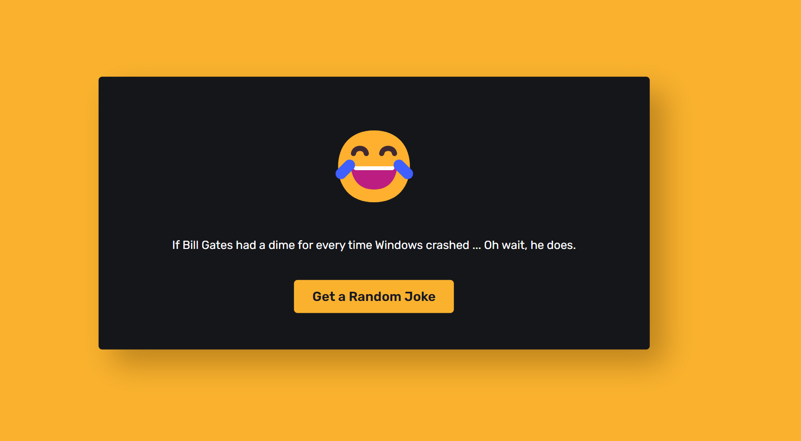

<h2>**Random Joke Generator 😂**</h2>

A fun and simple frontend webpage built using HTML, CSS, and JavaScript that fetches a random joke from an API to bring a smile to your face! This project is perfect for anyone who loves a good laugh or wants to explore how APIs work. 😄

<h3>Little Glimpse 👀</h3>

<h3>Features ✨</h3>
- **User-Friendly Interface**: Simple and clean design to get you to the jokes fast!  
- **Live Previews**: See a random joke in real-time with each click!  
- **Tech-Savvy Jokes**: Most jokes are tech-related for all the coding enthusiasts! 🤖💻  
- **API Integration**: Uses the JokeAPI to fetch jokes dynamically.  

<h3>API Reference 🔗</h3>
Get all items from the joke API:  
**GET**: `"https://v2.jokeapi.dev/joke/Any?blacklistFlags=nsfw,religious,political,racist,sexist,explicit&type=single"`  
This API returns a single joke excluding certain flagged categories like NSFW, political, and racist content. 🚫

<h3>How It Works 🔧</h3>
- The frontend is powered by HTML for structure, CSS for styling, and JavaScript for API integration.  
- With just a click, you can fetch a new joke, making it super interactive and fun. Click it as many times as you need to get your daily dose of humor! 😂

---

Enjoy the jokes and feel free to contribute if you have a favorite tech joke to add! 🤩
